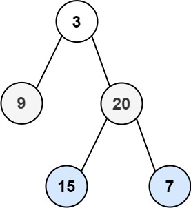

# 102. Binary Tree Level Order Traversal

Given the `root` of a binary tree, return the level order
traversal of its nodes' values. (i.e., from left to right, level by level).

### Example 1:

```
Input: root = [3,9,20,null,null,15,7]
Output: [[3],[9,20],[15,7]]
```

### Example 2
```
Input: root = [1]
Output: [[1]]
```

### Example 3
```
Input: root = []
Output: []
```

## Constraints 
* The number of nodes in the tree is in the range `[0, 2000]`.
* `-1000 <= Node.val <= 1000`


# Solution Tracing (Partial)

```
        /*
         Queue -> [3, null]
            While 1:
                currentLevelElements = []
                While 1:
                  current = 3
                    currentLevelElements = [3]
                    Queue = [null, 9, 20]
                While 2:
                    break;
                queue = [9, 20]
                queue = [9, 20, null]
                output = [[3]]
                currentLevelElements = []
            While 2:
                currentLevelElements = []
                While 1:
                    current = 9
                    queue = [20, null]
                    currentLevelElements = [9]
                While 2:
                    current = 20
                    currentLevelElements = [9, 20]
                    queue = [null, 15, 7]
                While 3:
                    break;
                queue = [15, 7]
        */
```