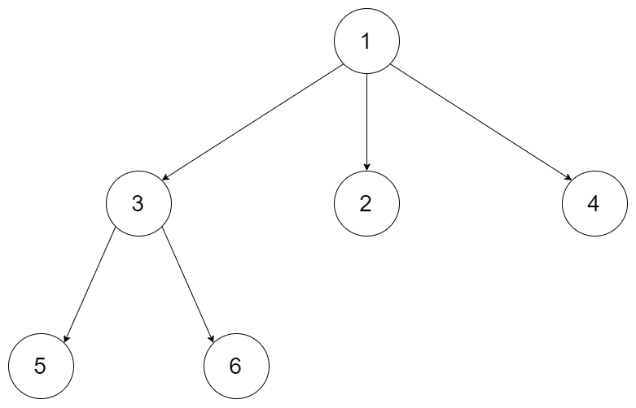
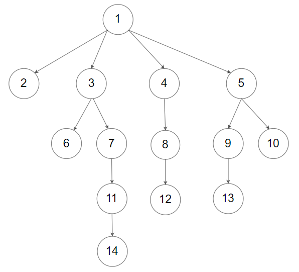

# 559. Maximum Depth of N-ary Tree

Given a n-ary tree, find its maximum depth.

The maximum depth is the number of nodes along the longest path from the root node down to the farthest leaf node.

N-ary Tree input serialization is represented in their level order traversal, 
each group of children is separated by the null value (See examples).

### Example 1


```
Input: root = [1,null,3,2,4,null,5,6]
Output: 3
```

### Example 2

```
Input: root = [1,null,2,3,4,5,null,null,6,7,null,8,null,9,10,null,null,11,null,12,null,13,null,null,14]
Output: 5
```

