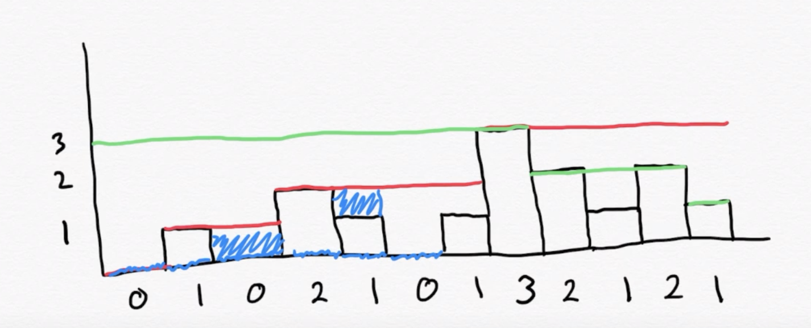

# 42. Trapping Rain Water

Given `n` non-negative integers representing an elevation map 
 where the width of each bar is `1`, compute how much water it 
 can trap after raining.
 
#### Example 1

Input: height = `[0,1,0,2,1,0,1,3,2,1,2,1]`

Output: `6`

Explanation: The above elevation map (black section) is represented
 by array `[0,1,0,2,1,0,1,3,2,1,2,1]`. In this case,`6` units of 
 rain water (blue section) are being trapped.
 
#### Example 2:

Input: height = `[4,2,0,3,2,5]`
Output: `9`

### Constraints:

* `n == height.length`
* `0 <= n <= 3 * 10^4`
* `0 <= height[i] <= 10^5`

## Solution 

1. For all the heights calculate the maximum height to the right from current element
1. For all the heights calculate the maximum height to the left from current element
1. The water height at curren would be minimum of step 1 and 2 minus thet current height
